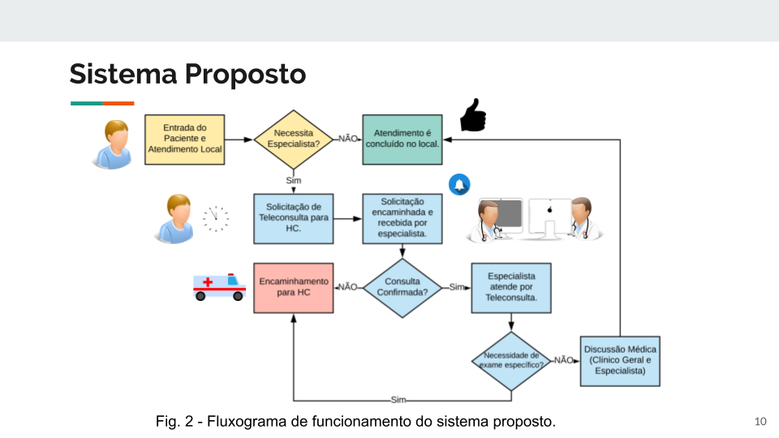
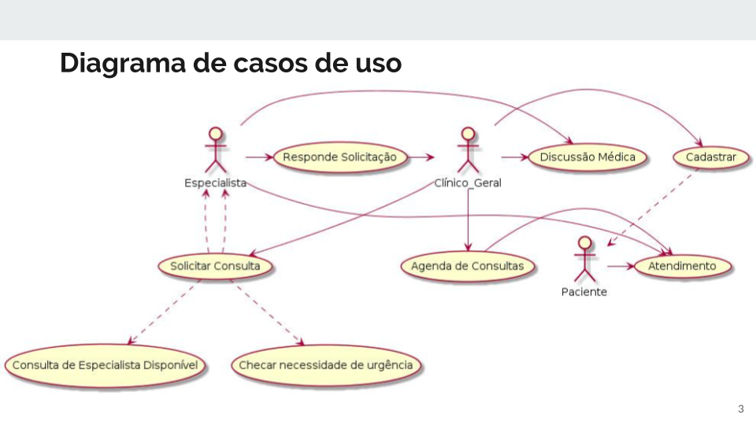
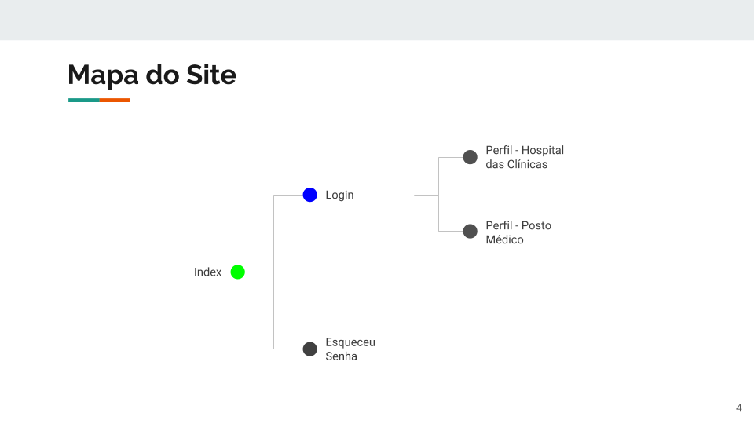
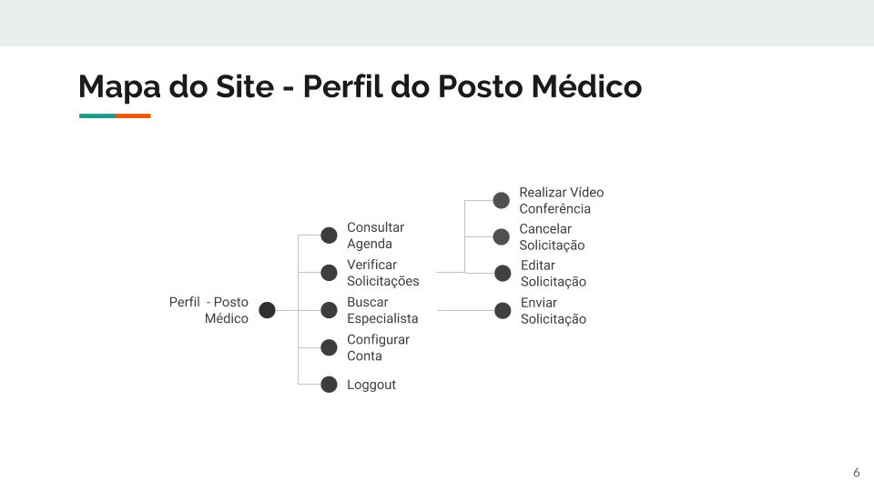

# TeleEspecialista Documentação
Documentação do projeto de Telemedicina.
http://tele-especialista.sytes.net/

## Configurando o Ambiente de Desenvolvimento

* Editor de texto utilizado: Atom
	* Como instalar:
	* Configurando:

* IDE: PHPStorm
	* Como instalar:
	* Configurando:

## Configurando o servidor WebRTC e seus arquivos dependentes
###### Installation Guide

> This page explains how to install RTCMultiConnection.

* Youtube Video: [NPM install](https://www.youtube.com/watch?v=EtsiYEW_T8Y) or [Other Videos](https://www.youtube.com/watch?v=EtsiYEW_T8Y&list=PLPRQUXAnRydKdyun-vjKPMrySoow2N4tl)

###### Fetch from Github

> Github is strongly recommended. NPM or TAR are secondary options.

```sh
git clone https://github.com/muaz-khan/RTCMultiConnection.git ./
npm install --production
```

Or download ZIP:

```sh
wget https://github.com/muaz-khan/RTCMultiConnection/archive/master.zip
unzip master.zip
```

Then call `npm install --production`.

Use `--production` to skip `grunt` dependencies. You don't need `grunt` until you modify library itself.

###### Install using NPM or Bower


```sh
npm install rtcmulticonnection --production

# or
bower install rtcmulticonnection
```

###### Run `server.js`

```sh
node server.js
```

Now open `http://localhost:9001/`.


## Configurações comuns:

* Adicionar tudo e **mandar** para o git: `./vai "mensagem do commit"`
    * Isso executará:
    ```
    git add .
    git commit -m "mensagem do commit"
    git push
    ```
* **Atualizar** o servidor:
```
# Acesse via ssh munido com a senha
ssh pi@tele-especialista.sytes.net
./vem
```
    * Isso executará:
    ```
    cd /var/www/
    git pull
    ```
## Configurando o Servidor
O site será hospedado em um servidor Linux rondando Raspian.
As seguintes configurações foram feitas:

### Configurações do Sistema
* Instalação do sistema Linux: [ELinux - Tutorial RPI](https://elinux.org/RPi_Easy_SD_Card_Setup#Using_the_Linux_command_line).
* O servidor foi ligado com uma tela, teclado e mouse para ser conectado a rede de internet disponível.
* Nas configurações do roteador o IP do servidor foi setado como fixo:
	* Abra a página de configuração do roteador, no meu caso: http://192.168.1.1/
	* Acesse DHPC e liste os dipositívos conectados, configure o IP local do servidor como um IP fixo.
	* IP local do servidor escolhido:  **192.168.1.142**

### Acesso SSH
* Instalação so openssh-server: `sudo apt-get install openssh-server`
* De qualquer outro computador, conectado ao mesmo roteador, utilize o seguinte comando para acessar o terminal do servidor:
```
ssh -X pi@192.168.1.142
```
	* A opção `-X` ativa o redirecionamento do X11.
	* `pi` é o nome de usuário.
	* `192.168.1.142` é o IP do servidor ssh.
    * Utilizando domínio: `ssh -X pi@tele-especialista.sytes.net`
    * Utilizando IP: `ssh -X pi@191.54.159.239`
* Na primeira conexão será pedido para aceitar as configurações do ssh.
* Em todas as conexões você deve ter em mãos a senha de usuário. Por padrão é `raspberry`, mas no nosso sistema ela foi modificada para garantir maior segurança, entre em contato caso necessite.

### Apache2
* O *Apache2* foi instalado através do seguinte comando: `sudo apt-get install apache2`
* Caso seja necessário reiniciá-lo utilize: `sudo /etc/init.d/apache2 restart`
* O apache colocará o que estiver na pasta `/var/www/html/` na sua rede local (http://localhost/). Para visualizar você pode acesar o IP do dispositivo (no caso `http://192.168.1.142/`) através de um computador conectado a mesma rede e você verá o arquivo index.html padrão do apache2 o algum outro caso tenha configurado.

### Port-Fowarding
Para que o sistema possa ser acessado por qualquer computador conectado a internet, não somente pelos computadores da rede local, o roteador foi configurado.
* Na página de configurações do roteador, acesse a sessão de port-fowarding (redirecionamento de portas).
* As seguintes configurações foram feitas:

Porta Externa | Protocolo | Porta Interna | IP Interno | Nome | Descrição
------------- | --------- | ------------- | ---------- | ---- | ---------
22 | TCP/UDP | 22 | 192.168.1.142 | SSH | Redireciona o acesso SSH, permitindo acessar o servidor a distância.
80 | TCP/UDP | 80 | 192.168.1.142 | DNS | Permite que o site seja acessado de qualquer lugar do mundo.

### GitHub
Para permitir a atualização dos arquivos hospedados pelo servidor, foi instalado o git.
* Instalação: `sudo apt-get install git`
* O repositório deste projeto foi clonado em `/var/www/` utilizando protocolo http.
* Para atualizar os arquivos do servidor execute:
```
cd /var/www/
git pull
```

### Banco de dados
* Instalação: `sudo apt-get install mysql-server`
* Configuração: `mysql_secure_installation`
    * Cofigure a senha. (Entre em contado com o dono do servidor para saber a senha.)
    * Remove anonymous users? [Y/n] **y**
    * Disallow root login remotely? [Y/n] **n**
    * Remove test database and access to it? [Y/n] **y**
    * Reload privilege tables now? [Y/n] **y**
* Comando útil: `service mysql restart`
* Uso: `mysql -u root -p`

### Banco de dados Configuração Extra
Devido a erros na configuração foi necessário realizar o seguinte:

The reason is that recent Ubuntu installation (maybe others also), mysql is using by default the UNIX auth_socket plugin.

Basically means that: db_users using it, will be "auth" by the system user credentias. You can see if your root user is set up like this by doing the following:


```
$ sudo mysql -u root # I had to use "sudo" since is new installation

mysql> USE mysql;
mysql> SELECT User, Host, plugin FROM mysql.user;

+------------------+-----------------------+
| User             | plugin                |
+------------------+-----------------------+
| root             | auth_socket           |
| mysql.sys        | mysql_native_password |
| debian-sys-maint | mysql_native_password |
+------------------+-----------------------+
```
As you can see in the query, the root user is using the auth_socket plugin

There are 2 ways to solve this:

1. You can set the root user to use the mysql_native_password plugin
1. You can create a new db_user with you system_user (recommended)

Option 1:

```
$ sudo mysql -u root # I had to use "sudo" since is new installation

mysql> USE mysql;
mysql> UPDATE user SET plugin='mysql_native_password' WHERE User='root';
mysql> FLUSH PRIVILEGES;
mysql> exit;

$ service mysql restart
```
Option 2: (replace YOUR_SYSTEM_USER with the username you have)
```
$ sudo mysql -u root # I had to use "sudo" since is new installation

mysql> USE mysql;
mysql> CREATE USER 'YOUR_SYSTEM_USER'@'localhost' IDENTIFIED BY '';
mysql> GRANT ALL PRIVILEGES ON *.* TO 'YOUR_SYSTEM_USER'@'localhost';
mysql> UPDATE user SET plugin='auth_socket' WHERE User='YOUR_SYSTEM_USER';
mysql> FLUSH PRIVILEGES;
mysql> exit;

$ service mysql restart
```
Remember that if you use option #2 you'll have to connect to mysql as your system username (`mysql -u YOUR_SYSTEM_USER`)

Note: On some systems (e.g., Debian stretch) 'auth_socket' plugin is called 'unix_socket', so the corresponding SQL command should be: `UPDATE user SET plugin='unix_socket' WHERE User='YOUR_SYSTEM_USER'`;

## Implementação

### Banco de dados
Foi criada a seguinte tabela:

#### Users

Campo | Tipo
----- | ----
id | INT PRIMARY KEY AUTO_INCREMENT
fullname | VARCHAR(256) NOT NUL
contact | VARCHAR(64) NOT NULL
username | VARCHAR(64) UNIQUE NOT NULL
password | VARCHAR(64) NOT NULL
active | BOOLEAN DEFAULT 1

## Proposta do Sistema
**Sistema Atual**

**Nossa Proposta**


## Diagramas UML
**Use-Cases**

**Mapa do Site**

**Mapa do Site - Perfil do Hospital das Clínicas**

**Mapa do Site - Perfil do Posto Médico**


## Wireframe
**Index**


## Referências
* Diagramas UML:
    * Lucid Chart <https://www.lucidchart.com/pages/examples/uml_diagram_tool>
    * Plant UML<http://plantuml.com/>
    * DevMedica <https://www.devmedia.com.br/o-que-e-uml-e-diagramas-de-caso-de-uso-introducao-pratica-a-uml/23408>
* Wireframe:
    * Wikipedia <https://pt.wikipedia.org/wiki/Website_wireframe>
    * Minimal Wireframe Tool<https://wireframe.cc/>
* Desenvolvimento de uma tela (HTML, CSS, JavaScript):
    * W3 Schools <https://www.w3schools.com/>
    * Banco de dados  Firebase <https://youtu.be/-OKrloDzGpU>  
    * Bootstrap <https://startbootstrap.com/template-categories/all/>

## Autores

* Ítalo G. S. Fernandes
* Lucas L. Franco
* Mariane M. Oliveira
* Nathalia Rodrigues
* Paulo Camargos
